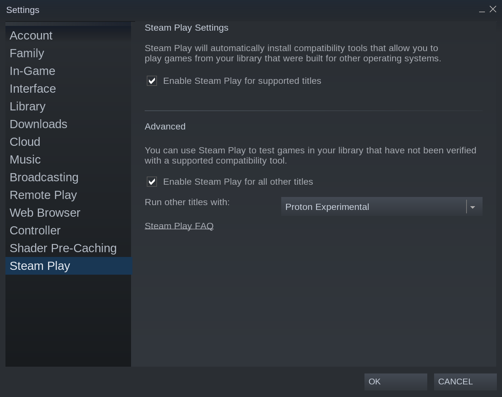

(howto::configure-proton)=
# Configure Proton/Steam Play

[Proton](https://github.com/ValveSoftware/Proton) is software developed by Valve that allows Windows games 
to run on Linux, and is used by the Steam Play client.

Using {term}`Proton`/{term}`Steam Play` is not always necessary. If the game installs and runs without
Proton, it is native and likely works the best without Proton.

## Check if a game requires Proton

[ProtonDB](https://www.protondb.com/), a crowdsourced database of compatibility information, will show "Native" if the game is a {term}`native game`. Otherwise, it requires Proton.

Disabling Steam Play entirely will only then allow you to install and play native games.

## Enable Proton for non-native games

In the Steam application, navigate to {guilabel}`Settings` > {guilabel}`Steam Play`

Enabling Steam Play will automatically download the Proton {term}`compatibility layer` libraries
for non-native games. If left disabled, only native games can be installed and
played.

"Enable Steam Play for supported titles" enables compatibility layer tools for games
verified by Valve to work well on Linux.

"Enable Steam Play for all other titles" enables compatibility layer tools for *all*
non-native games in your library. 

Unsupported titles greatly vary in functionality -- check {term}`ProtonDB` for more info on specific games.

 

## Enable Proton for an individual game

Right-click on the game title in your library, then navigate to {guilabel}`Properties` > {guilabel}`Compatibility`

Check "Force the use of a Specific Steam Play compatibility tool", and choose a Proton version.

## Use a custom Proton version

Run Steam at least once.

Create the `compatibilitytools.d` directory:

```shell
mkdir -p ~/snap/steam/common/.steam/root/compatibilitytools.d
```

Extract custom Proton versions to the above directory. For example, [proton-ge](https://github.com/GloriousEggroll/proton-ge-custom).

Run Steam, and you should be able to select your custom version from the Proton version dropdown like normal.

```{seealso}
[Original `proton-ge-custom` instructions](https://github.com/GloriousEggroll/proton-ge-custom#snap)
```
