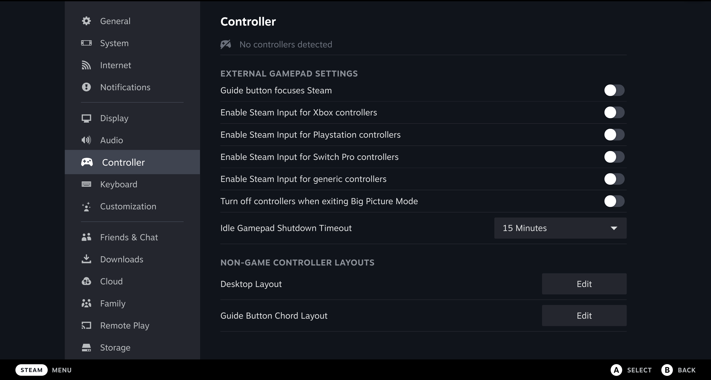

---
myst:
  html_meta:
    "description lang=en":
      "Use controllers with the Steam snap on Ubuntu."
---

(howto::set-up-controller)=
# Set up a controller

In Steam, enter Big Picture Mode (next to the close and minimize buttons on the
top right of the client), then go to `Settings > Controller`.

You should be able to enable configurations for your controller type and see
your controller appear in the list.

If you have issues, try the steps outlined in the following sections.

## Connect plugs

If you can't enable the configurations, make sure the following plugs are
connected (these will likely already be connected automatically) using the
following commands:

- **joystick**: `snap connect steam:joystick`
- **hardware-observe**: `snap connect steam:hardware-observe`
- **uinput**: `snap connect steam:uinput`

## Install steam devices

You may also need to install the `steam-devices` deb package on your host
system, with `sudo apt install --no-install-recommends steam-devices`.

 
