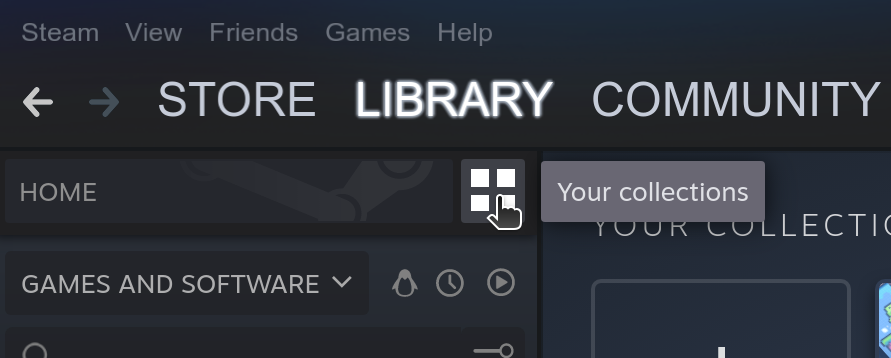
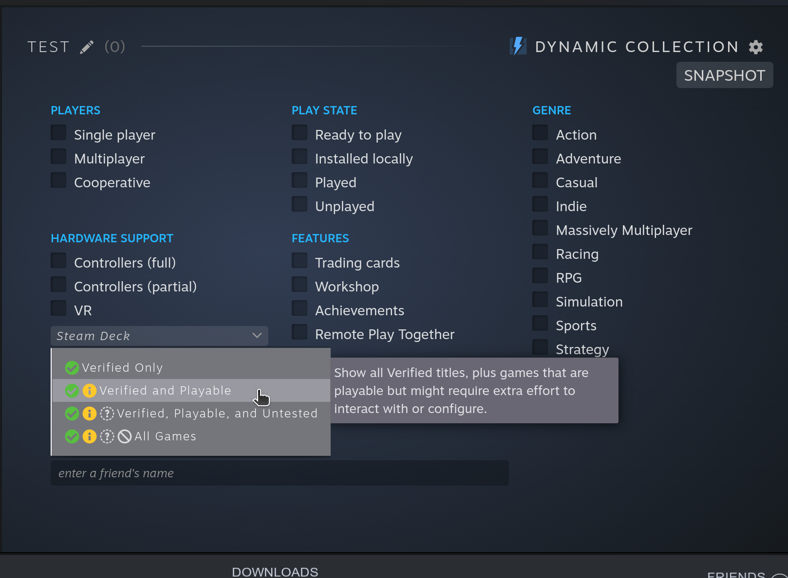

---
myst:
  html_meta:
    "description lang=en":
      "Help us test the Steam snap on Ubuntu."
---

(howto::test)=
# Testing the Steam snap

```{note}
This testing procedure is generally for internal use.
```

The following steps assume you have successfully created a `steam_*.snap` with
`snapcraft` and installed it with `snap install steam_*.snap --dangerous`. This
also assumes you have Steam Play (Proton) enabled for any game.

Repeat the below steps on every combination of GPUs possible on your system.
On hybrid systems, try in hybrid mode (both cards on and available) and
dedicated GPU modes (single card on and available). 

See the page on [using a dedicated GPU](./dedicated-gpu.md) for tips on
switching graphics cards.

## Minimum steps

- Run `snap run steam.test`. Ensure GLX and Vulkan both report "passed".
- Run `snap run steam.report --no-submit`. Ensure that no error occurs and each
  field is populated with the correct data for your system.
- Run `snap run steam`. Ensure Steam correctly starts, you can log in, and each
  tab (Store, Library, etc.) populates correctly with content.
- Run some games. Ensure they open and can be played.

## Additional suggested steps

- Run each game listed in the [Suggested Games](howto::suggested-games)
  section. At a minimum, choose 1 Native game and 1 Proton game. Check that the
  games:
    - Open correctly to main menu
    - Respond to input, plays audio, and displays graphical content
    - Use the correct GPU
    - Settings (especially graphics) populate correctly and can be modified
    - Changes window mode (full screen, windowed)
    - `Alt-Tab` works and doesn't crash the game
    - Can be played properly
- Install a game. Ensure the installer UI is correct, the game is installed in
  the right place, and it can be played.
- Switch to different gaming-graphics-core24 branches and ensure all of them
  work correctly. You can switch between branches using `sudo snap refresh
  gaming-graphics-core24 --channel=<branch>/stable`. The three branches are
  `oibaf-latest`, `kisak-fresh` and `kisak-turtle`.
- Plug in a supported controller (PS4, Xbox One and Xbox 360 controllers) and
  make sure the input is processed in the games.

## Additional optional steps

- Run each game listed in the [Additional Games](howto::additional-games) section.
    - Opens correctly to main menu
    - Responds to input, plays audio, and displays graphical content
    - Uses the correct GPU
    - Settings (especially graphics) populate correctly and can be modified
    - Changes window mode (full screen, windowed)
    - `Alt-Tab` works and doesn't crash the game
    - Can be played properly
- Go to `Steam > Settings > Downloads > Steam Library Folders`. Ensure you can
  add additional locations on the same disk, and locations on external disks.
  Also ensure you can install a game in each location.
- Go to `Steam > Settings > Steam Play` and ensure you can toggle Steam Play
  and alter Proton versions.
- Go to Big Picture Mode. Ensure all text is properly displayed and you can
  navigate the UI.
- Switch to non-English keyboard (ex. Russian). Ensure you can type non-English
- [Ensure you can add a custom Proton version and use it.](https://github.com/canonical/steam-snap/wiki/FAQ#how-do-i-use-a-custom-proton-version)
characters into the Steam client.
- Test MangoHud
    - In the Snap shell, make sure MangoHud works with `mangohud glxgears`.
    - For *native* games, ensure adding `mangohud %command%` as launch options
      works and displays MangoHud.
    - For *Proton* games, MangoHud is not expected to work, see
      [here](https://github.com/flightlessmango/MangoHud/issues/369). The game
      should run, however.

## Games

The following is a list of *free* games using various engines and varying Linux support.

If you cannot run every game in a list, prioritize games in top-down order and
ensure you use both a Proton and a Native game.

(howto::suggested-games)=
### Suggested games

*These games are generally small in scope and size.*

| Game | Native/Proton | Engine | Link |
|------|---------------|--------|------|
| Team Fortress 2 | Native | Source | https://store.steampowered.com/app/440 |
| Floating Point | Native | Unity | https://store.steampowered.com/app/302380 |
| Life is Strange - Episode 1 | Native | Unreal | https://store.steampowered.com/app/319630 |
| Rocket Bots | Native | Godot | https://store.steampowered.com/app/1359160 |
||
||
| Unturned | Proton | Unity | https://store.steampowered.com/app/304930 |
| - | Proton | Unreal | - |
| - | Proton | Source | - |
| Brawlhalla | Proton | Custom | - | https://store.steampowered.com/app/291550 |
| Goose Goose Duck | Proton | ? | https://store.steampowered.com/app/1568590 |

(howto::additional-games)=
### Additional games

*These games are generally large in scope and size.*

| Game | Native/Proton | Engine | Link |
|------|---------------|--------|------|
| Apex Legends | Native | Source | https://store.steampowered.com/app/730 |
| - | - | Unity | - |
| - | - | Unreal | - |
| - | - | Godot | - |

### Collections

Steam game collections can be a useful feature for keeping track of well-tested games. Follow these steps to create a *Dynamic Collection* that automatically populates with games based on Steam Deck status:

1. Go to Steam's Library tab
2. Click the four boxes to the right of Home 
>  
3. Click the empty box labeled "Create a new Collection"
4. Give it a name, e.g. "Verified and Playable on Deck"
5. Select *Create Dynamic Collection*; alternatively, select *Create Collection* to manually add games yourself
6. Under Hardware Support, click the *Steam Deck* dropdown and select a verified status for the collection
>  
7. Scroll down and you should see all the games in your library that meet the criteria you selected

Repeat steps 1 and 2 to see past collections you've made or to create new collections.
