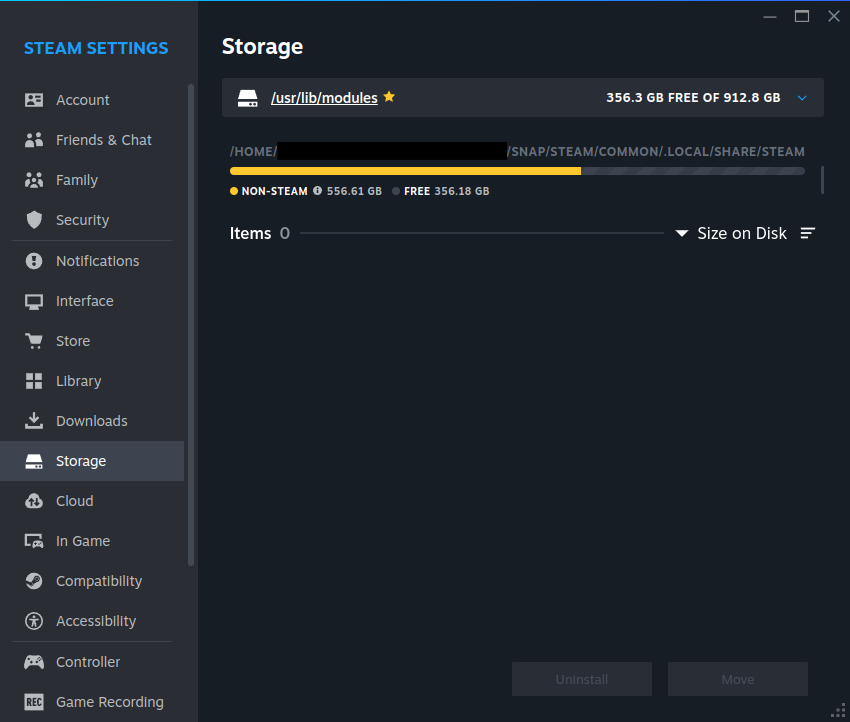

---
myst:
  html_meta:
    "description lang=en":
      "Useful links for Steam users on Ubuntu."
---

(ref::external-libs)=
# Locations for external libraries

The default install directory could be misleadingly listed as
`/usr/lib/modules`, but this actually points to
`~/snap/steam/common/.local/share/steam`.

You can verify the actual install directory by going to `Settings > Storage`
and noting the full path listed:

You can add external storage libraries as you normally would through Steam
settings > Storage, but the snap is restricted to libraries located in `~`,
`/media`, `/run/media`, or `/mnt`.

This same restriction applies to adding non-Steam games.
